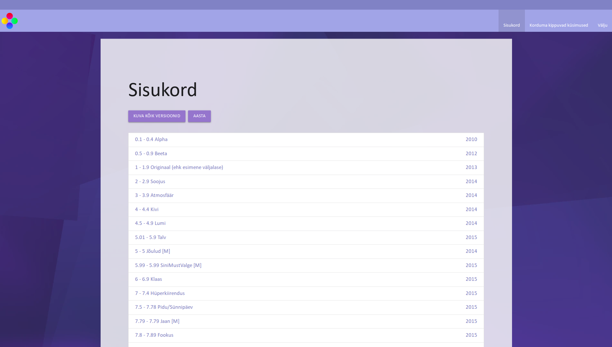

# Markuse asjade versionid

See veebirakendus võimaldab lugeda erinevate Markuse asjade versioonide kohta. Töötab ainult siis, kui see asub alamkaustas /mas_db ja kui olemas on setup.php fail juurkataloogis, mis sisaldab andmebaasiga ühendamiseks vajalikku infot. "setup.php" saab genereerida markusmaal.ee veebirakenduse ehitaja (/builder) abil.

Sisu muutmiseks saab kasutada markusmaal.ee rakenduses admin vaadet.

[Live version](https://markusmaal.ee/mas_db)
